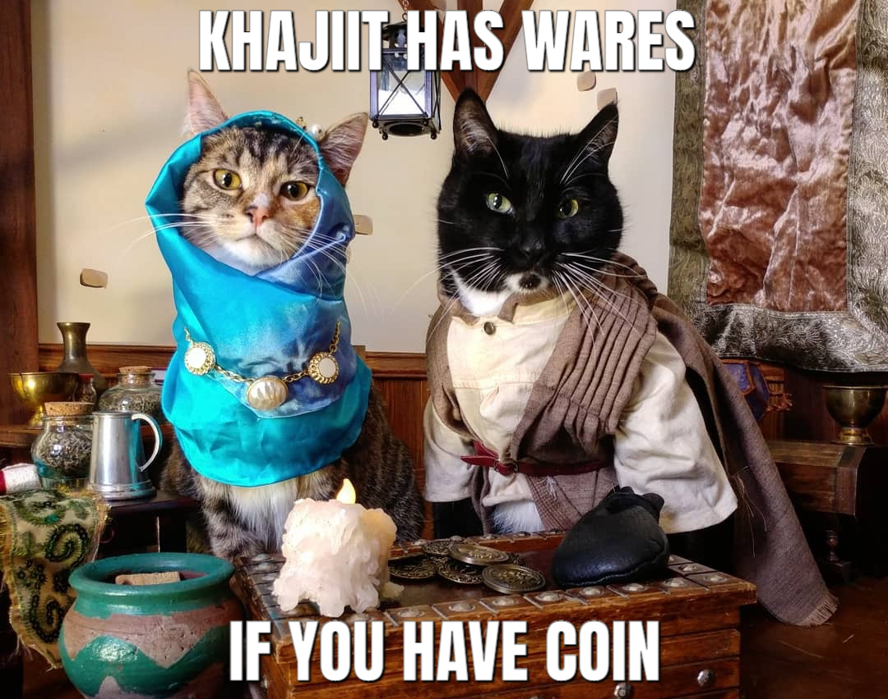
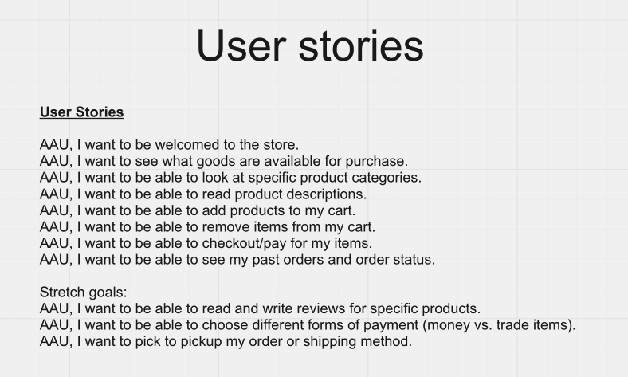
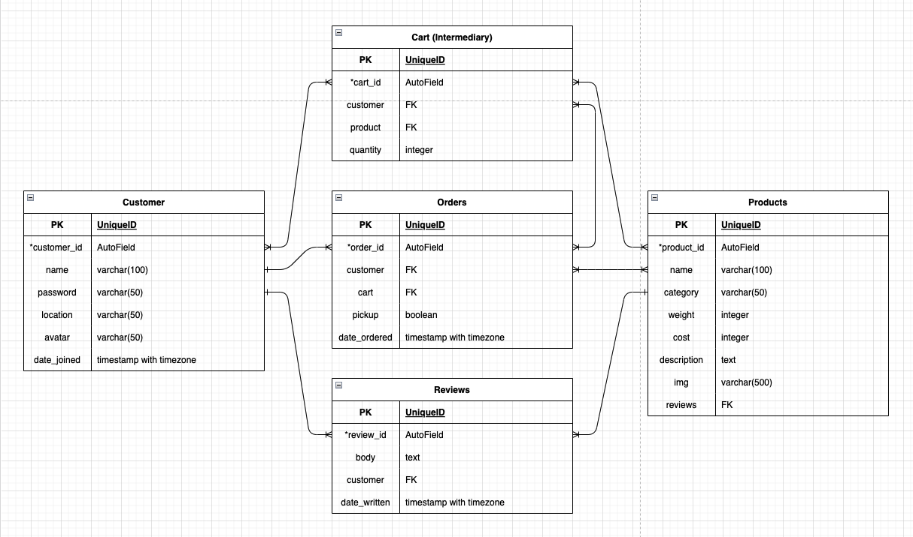
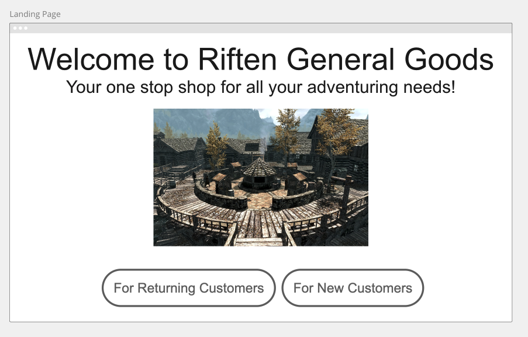
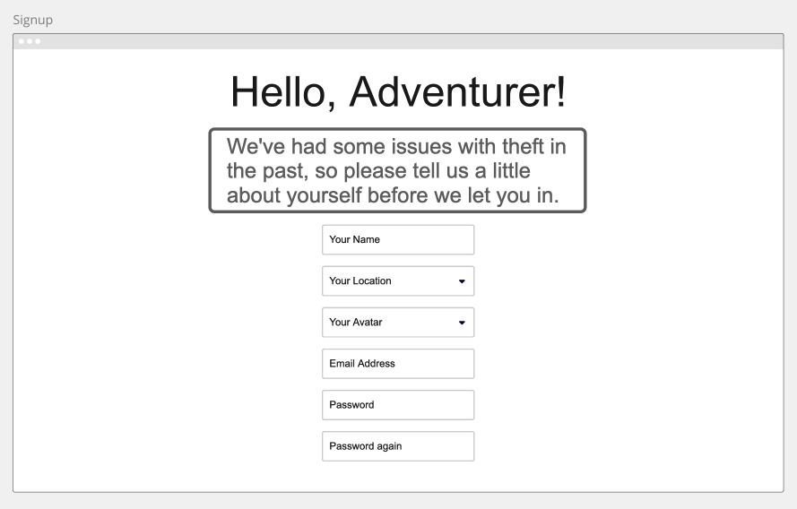
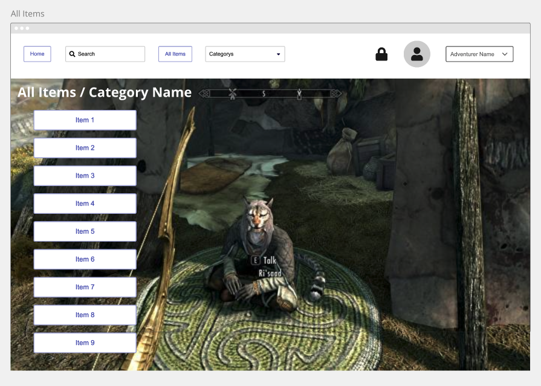
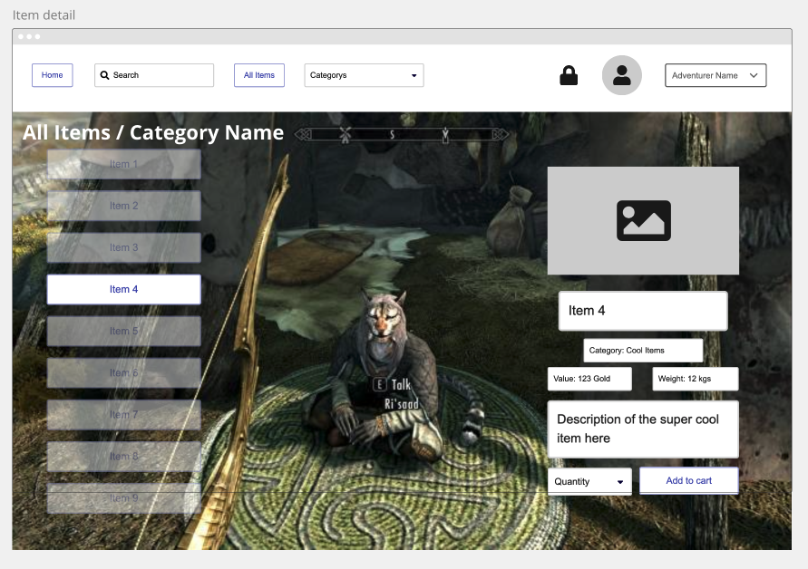
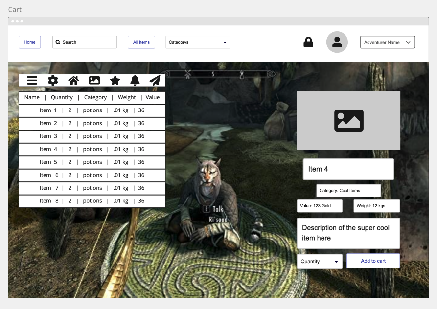
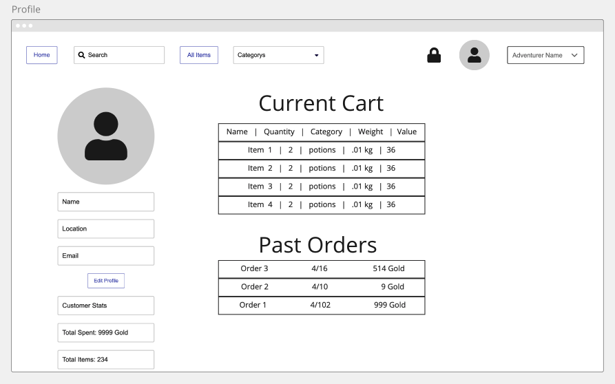

# Riften General Goods
A website for intrepid adventurers to stock up on needed supplies for their travels.

## Table of Contents
[Project Description](#project-description)  
[Project Requirements](#project-requirements)  
[Technologies Used](#technologies-used)  
[Deployment](#deployment)  
[Github Repo](#github-repo)  
[User Stories](#user-stories)   
[ERD](#erd)  
[Wireframes](#wireframes)  
[Sourced Media](#sourced-media)  
[Credits](#credits)  

## Project Description
This is a solo concept project to create a e-commerce site for a fictional store. Because it is purely conceptual, instead of basing it in reality I decided to base it on a RPG video game general goods merchant, most tied to the Skyrim universe. I wanted it to be a little fun, while still having the functionality of a real online store. 

## Project Requirements
  - Database using Mongodb or Postgresql.  
  - Full-stack application, using NEM, MERN, or Django.  
  - At least two related databade models, and full CRUD between them.  
  - Thoughtful and delightful design  
    - Use framework or CSS, or both   
  - Thoughtful user stories  
  - Error Handling  
  - Heroku deployment  
  - Useful README (boom, this right here, off to a good start)  
  - Stretch goals
    - Responsive Design for tablet or phone usage
    - Light mode / dark mode toggle

## Technologies Used
    - Django  
    - PostgreSQL 
    - Bootstrap  
    - Heroku
    - Miro and Draw.io for planning 

## Deployment
[https://riften-general-goods.herokuapp.com/ - Not yet deployed](https://riften-general-goods.herokuapp.com/)

## Github Repo
[https://github.com/mbahan1/riften-general-goods](https://github.com/mbahan1/riften-general-goods)

## User Stories

## ERD

## Wireframes

## Sourced Media
README image:
https://64.media.tumblr.com/e25ec309c11fca296538219bf2a71dad/tumblr_ps4oc1tEDm1rxvgdh_1280.jpg
Riften marketplace:
https://static.wikia.nocookie.net/elderscrolls/images/9/9a/Riften_Marketplace.png/revision/latest?cb=20121108234308
Khajiit merchant:
https://asset.vg247.com/skyrim-saints-and-seducers-find-risaad.jpg/BROK/resize/690%3E/format/jpg/quality/70/skyrim-saints-and-seducers-find-risaad.jpg

## Credits
Thanks to the 1026 GA instructors for help when I hit roadblocks and teaching me all the tools used here.

https://github.com/pennersr/django-allauth
https://learndjango.com/tutorials/django-log-in-email-not-username